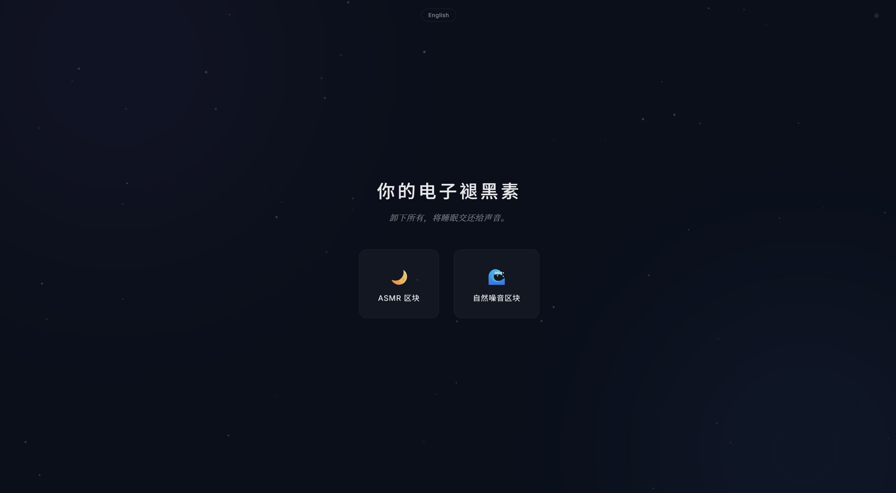
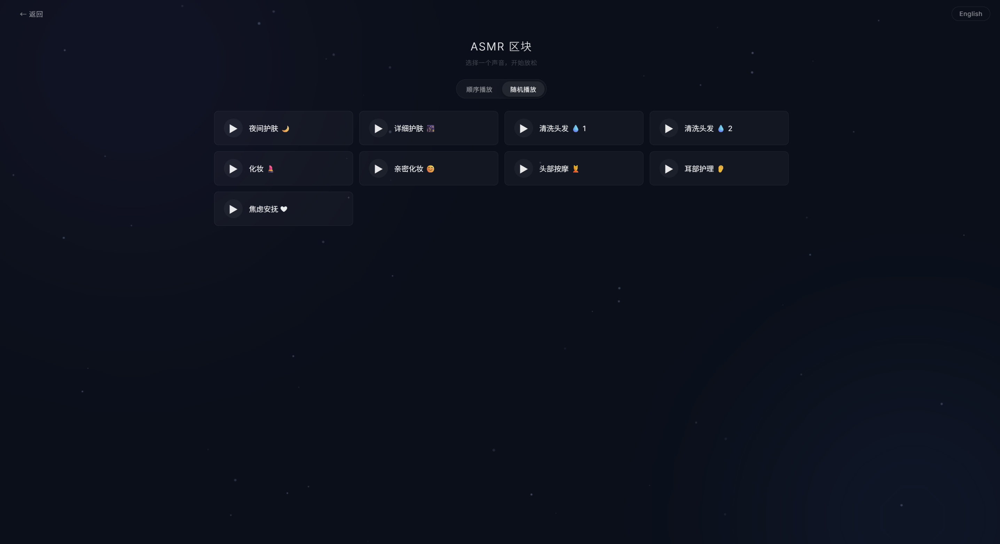
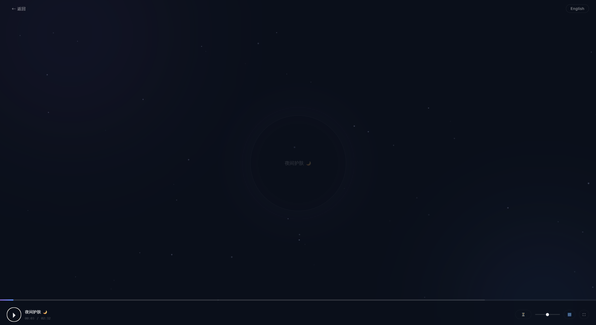
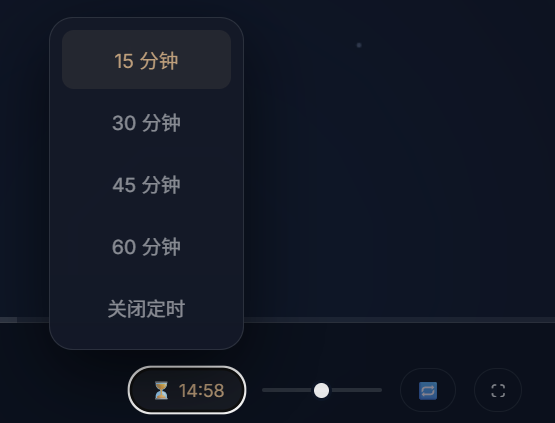
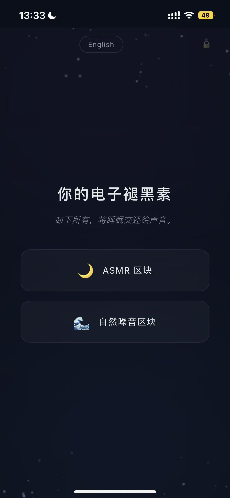

# 你的电子褪黑素 · MyMelatonin

> 卸下所有，将睡眠交还给声音。

**MyMelatonin** 是一个沉浸式助眠白噪音 Web 应用。内置 ASMR 与自然噪音双频道，支持播放进度控制、睡眠定时器、全屏沉浸模式。纯前端实现，开箱即用。

🌐 **在线体验**：[GitHub Pages 占位 — 部署后替换此链接](https://your-username.github.io/MyMelatonin)

---

## ✨ 功能亮点

| 模块 | 功能 |
|------|------|
| 🎵 **双频道** | 9 首 ASMR + 19 首自然白噪音，中英双语 |
| 🎚️ **播放控制** | 播放/暂停、进度条拖拽 Seek、音量调节、循环模式 |
| ⏳ **睡眠定时器** | 15/30/45/60 分钟定时，最后 30 秒自动淡出，到点弹出晚安提示 |
| 🌙 **沉浸模式** | 暗色主题 + 粒子背景 + 3 层呼吸光晕 + 环境光渐变 |
| ⌨️ **键盘快捷键** | `Space` 播放/暂停 · `F` 全屏 · `←→` 快进快退 · `↑↓` 音量 · `ESC` 返回 |
| 💾 **偏好记忆** | localStorage 自动记录音量、语言、播放模式、循环设置 |
| 📱 **全响应式** | 5 断点覆盖手机 / 平板 / 桌面 / 横屏，毛玻璃控制栏 |
| 🌐 **离线友好** | 断网检测与提示 |

---

## 🖼️ 界面预览

> *以下为截图占位描述，请替换为实际截图。*

| 首页 | 列表页 | 播放页 |
|:---:|:---:|:---:|
|  |  |  |
| *暗色主题入口，双卡片选择频道* | *曲目列表，支持顺序/随机模式* | *3 层呼吸光晕 + 粒子背景* |

| 睡眠定时器 | 移动端适配 |
|:---:|:---:|
|  |  |
| *4 档定时，倒计时 + 淡出* | *全响应式，手机体验完整* |

---

## 🛠 技术栈

- **纯原生实现** — 零框架，零构建，零依赖（仅 Google Fonts CDN）
- **CSS3** — Custom Properties 主题系统 · `backdrop-filter` 毛玻璃 · CSS Animations · Grid/Flexbox 布局
- **Canvas API** — 60 粒子实时渲染，页面不可见时自动暂停
- **HTML5 Audio API** — 播放控制 · 缓冲检测 · 错误恢复
- **localStorage** — 用户偏好持久化
- **Fullscreen API** — 一键沉浸模式
- **Network Information** — 在线/离线状态监听

### 为什么选择纯原生？

对于简历项目，纯原生实现能够最直接地展示对 **HTML/CSS/JS 核心能力的掌握**：
- 不依赖框架隐藏复杂度
- 面试官一眼就能看到你对 DOM、事件、动画、音频 API 的理解深度
- 代码结构通过 IIFE 模块化 + 命名空间管理，展示了工程化思维

---

## 🚀 本地运行

```bash
# 1. 克隆仓库
git clone https://github.com/your-username/MyMelatonin.git
cd MyMelatonin

# 2. 启动本地服务器（任选其一）
# Python
python -m http.server 8080

# Node.js (npx)
npx serve .

# VS Code Live Server 插件

# 3. 浏览器打开
# http://localhost:8080
```

> ⚠️ 直接用 `file://` 协议打开可能导致音频无法加载（CORS 限制），请使用本地服务器。

---

## 📁 项目结构

```
MyMelatonin/
├── index.html              # 主应用（HTML + CSS + JS 单文件）
├── README.md               # 项目文档
├── .gitignore
├── screenshots/            # 截图（待补充）
│   ├── home.png
│   ├── list.png
│   ├── player.png
│   ├── timer.png
│   └── mobile.png
├── ASMR/                   # ASMR 音频（9 首）
│   ├── norm_nighttime_skincare_asmr.mp3
│   ├── norm_ultra_detailed_skincare_asmr.mp3
│   ├── norm_hairwashing1_asmr.mp3
│   ├── norm_hairwashing2_asmr.mp3
│   ├── norm_makeup_asmr.mp3
│   ├── norm_intimate_makeup_asmr.mp3
│   ├── norm_deep_scalp_massage_asmr.mp3
│   ├── norm_ear_clinic_asmr.mp3
│   └── norm_calm_down_after_anxiety_asmr.mp3
└── Natural_Noise/          # 自然白噪音（19 首）
    ├── beach_soft_waves.mp3
    ├── bike_and_car_passing_in_rain.mp3
    ├── forest_cabin_summer_rain.mp3
    ├── garage_running_water.mp3
    ├── light_rain.mp3
    ├── light_rain2.mp3
    ├── light_waves_at_harbor.mp3
    ├── ocean_waves_constant_splashing.mp3
    ├── pink_noise_waterfall.mp3
    ├── river_with_small_rapids.mp3
    ├── slow_medium_waves_with_crickets.mp3
    ├── slow_ocean_waves.mp3
    ├── soft_mountain_stream.mp3
    ├── soft_rain_on_roof.mp3
    ├── soft_rain1.mp3
    ├── soft_rain2.mp3
    ├── soft_wave_for_relaxation.mp3
    ├── stream_river_up_close.mp3
    └── thick_soft_river.mp3
```

---

## 🔑 键盘快捷键

| 按键 | 功能 |
|:---:|------|
| `Space` | 播放 / 暂停 |
| `F` | 进入 / 退出全屏 |
| `ESC` | 退出全屏 / 返回上一页 |
| `←` | 快退 10 秒 |
| `→` | 快进 10 秒 |
| `↑` | 音量 +5% |
| `↓` | 音量 -5% |

---

## 🎯 设计理念

- **沉浸优先** — 暗色基调 + 环境光渐变 + 粒子漂浮，模拟深夜放松氛围
- **触感反馈** — 所有交互均有 hover/active 过渡，毛玻璃底栏符合 iOS 设计语言
- **渐进增强** — 键盘快捷键和全屏模式对高级用户可用，但不强制依赖
- **尊重隐私** — 纯前端，无埋点、无后端、无 Cookie

---

## 📝 待办事项

- [ ] 截取实际界面截图替换 `screenshots/` 占位
- [ ] 部署到 GitHub Pages / Vercel，更新在线链接
- [ ] （可选）音频混音功能：同时播放多个声音
- [ ] （可选）添加 PWA manifest 和 Service Worker 缓存

---

## 📄 License

MIT © 2025
